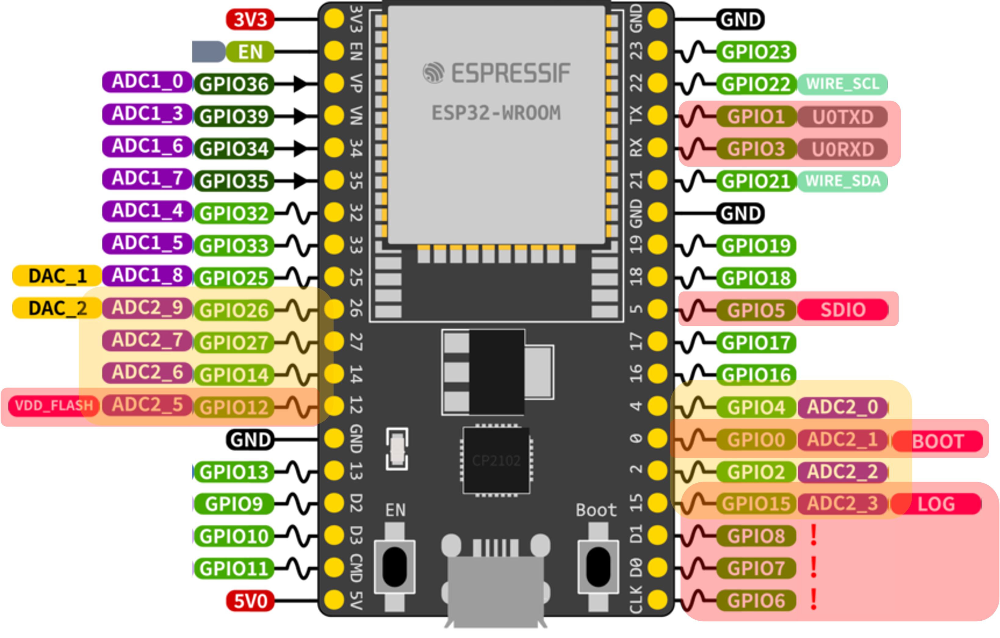
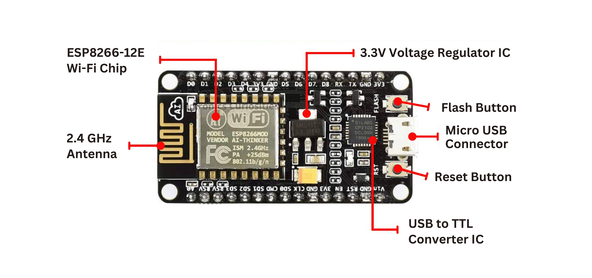
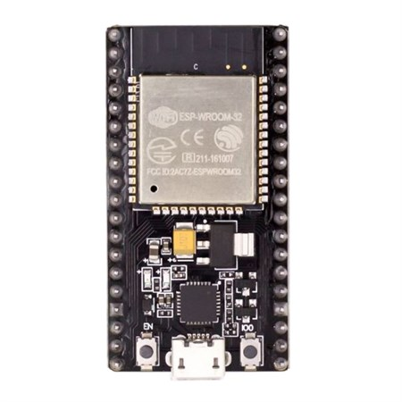
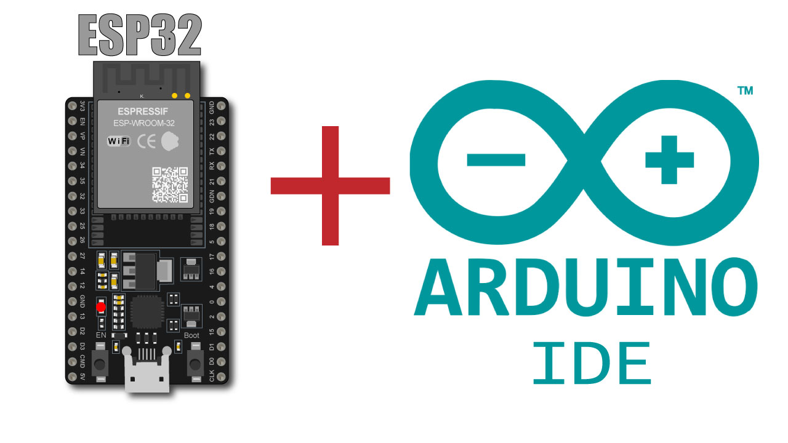

# Formation ESP32  
## Introduction aux microcontrôleurs modernes  
*Auteur: Houssem-eddine LAHMER*  

---

## Introduction  

### Les limites de l'Arduino classique  
- Popularité historique (depuis 2005) mais technologie vieillissante  
- Limitations techniques :  
  - Fréquence d'horloge à 16 MHz  
  - Connectivité sans fil nécessite des modules externes  
  - Capacités de traitement limitées  
  - Mémoire RAM restreinte (2-8 KB)  
- Écosystème principalement orienté débutants  

> **Un besoin émergent**  
> Nécessité croissante de :  
> - Connectivité native (WiFi/Bluetooth)  
> - Plus grande puissance de calcul  
> - Gestion d'énergie avancée  
> - Interfaces matérielles spécialisées  

---

### L'ESP32 : Un successeur moderne  

  

- Système sur puce (SoC) d'Espressif Systems  
- Double coeur Xtensa LX6 (240 MHz)  
- Connectivité intégrée :  
  - WiFi 802.11 b/g/n  
  - Bluetooth 4.2 + BLE  
- Ultra basse consommation (10 uA en veille)  
- 520 KB SRAM, 4-16 MB Flash  
- 34 GPIOs programmables  

---

### Évolution technologique  

| Caractéristique | ESP8266       | ESP32          |
|-----------------|---------------|----------------|
| Cores           | Single        | Dual           |
| Fréquence       | 80 MHz        | 160/240 MHz    |
| RAM             | 80 KB         | 520 KB         |
| Bluetooth       | Non           | Oui            |
| ADC             | 10-bit        | 12-bit         |
| GPIO            | 17            | 34             |
| Prix            | \$1-\$2       | \$2-\$5        |

**Avantages clés** : Rapport performance/prix exceptionnel + Connectivité native  

---

### Arduino IDE pour ESP32  

  

- Environnement de développement familier  
- Support natif via Boards Manager  
- Mêmes concepts de base :  
  - Structure setup()/loop()  
  - Gestion des pins numérique/analogique  
  - Bibliothèques compatibles  
- Extensions spécifiques :  
  - Gestion du dual core  
  - Bluetooth/BLE  
  - Deep sleep  

---

## Présentation de l'ESP32  

### Qu'est-ce que l'ESP32 ?  

> **Définition**  
> Microcontrôleur 32 bits **low-cost** avec :  
> - Architecture Xtensa® Dual-Core (240 MHz)  
> - Mémoire Flash: 4MB (extensible)  
> - RAM: 520KB SRAM + 8KB RTC  
> - Consommation: 0.15uA en veille profonde  

- Intègre nativement :  
  - WiFi 802.11 b/g/n (2.4 GHz)  
  - Bluetooth 4.2 + BLE  
  - 34 GPIOs multifonctions  
  - 18 canaux ADC 12-bit  

---

### Utilité de l'ESP32  

  

- Alternative puissante aux cartes Arduino :  
  - 240 MHz vs 16 MHz (Arduino Uno)  
  - 520KB RAM vs 2KB  
  - Connectivité intégrée vs modules externes  
- Compatibilité Arduino IDE :  
  - Même structure de code (setup/loop)  
  - Librairies réutilisables  
  - Workflow identique  

**Avantage clé** : Miniaturisation extrême (3x5cm) + Écosystème mature + Coût < 5\$  

---

### Connectivité avancée  

**Sans fil**  
- WiFi :  
  - Mode Station (client)  
  - Mode Point d'accès  
  - Débit jusqu'à 150Mbps  
- Bluetooth :  
  - Classique (audio, données)  
  - BLE (capteurs IoT)  
  - Mesh networking  

**Interfaces matérielles**  
- GPIOs : 34 (dont 18 ADC)  
- DAC : 2 canaux 8-bit  
- Touch : 10 capteurs  
- PWM : 16 canaux  

---

### Brochage de l'ESP32 DEVKIT  

  

- Broches multifonctions configurables :  
  - Communication série (UART, SPI, I2C)  
  - Entrées analogiques (ADC)  
  - Sorties PWM  
  - Capteurs capacitifs  
- Alimentation flexible : 3.3V (USB) ou 5V (externe)  

---

## Comparaisons techniques  

### ESP32 vs ESP8266  

| Caractéristique | ESP8266         | ESP32           |
|-----------------|-----------------|-----------------|
| MCU             | Single-core     | Dual-Core       |
| Fréquence       | 80 MHz          | 160/240 MHz     |
| RAM             | 80 KB           | 520 KB          |
| Bluetooth       | Non             | Oui             |
| GPIO            | 17              | 34              |
| Prix            | \$1-\$2         | \$2-\$5         |

**Avantages clés ESP32** : Dual-core • Bluetooth • Meilleures performances  

---

### Comparaison visuelle  

  
  

- Différences physiques :  
  - Taille des modules  
  - Nombre de broches GPIO  
  - Composants supplémentaires (antenne PCB)  

---

## Outils de développement  

### Environnements principaux  

**Outils officiels**  
- Arduino IDE  
- ESP-IDF (Framework natif)  
- Flash Download Tools  

**Outils tiers**  
- PlatformIO (VSCode)  
- MicroPython  
- Simulateurs Wokwi  

---

### Arduino IDE  

  

- Configuration simple via Boards Manager  
- Syntaxe familière (setup/loop)  
- Gestion des bibliothèques intégrée  
- Débogage via Serial Monitor  

---

### PlatformIO  

**Fonctionnalités clés**  
- Gestion avancée des dépendances  
- Débogage avec JTAG/SWD  
- Tests unitaires intégrés  
- Support multi-cartes  

```cpp
// Exemple de code PlatformIO  
void setup() { Serial.begin(115200); }  
void loop() { Serial.println("Hello ESP32"); }
```

---

### Wokwi - Simulateur IoT  

  

- Simulation navigateur sans installation  
- Composants virtuels : capteurs, écrans, protocoles  
- Débogage temps réel  
- Collaboration en temps réel  

**Avantages** : 🚀 Prototypage rapide • 💸 Aucun matériel requis  
