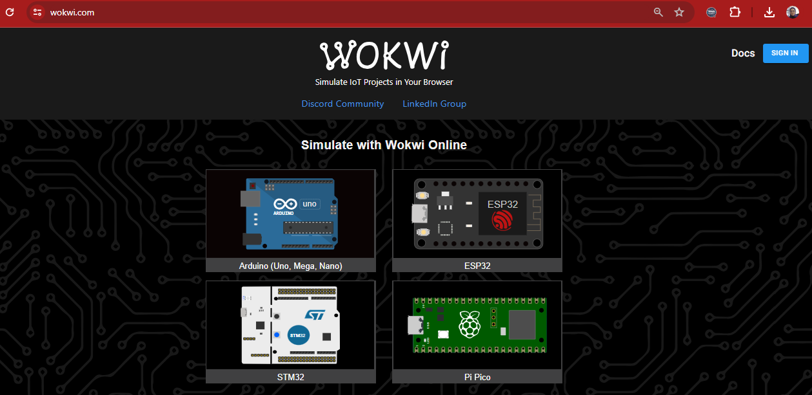
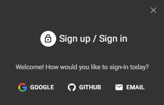

# Getting Started with Wokwi Simulator

Wokwi is an online platform offering simulators for IoT and embedded systems, including **ESP32**, STM32, Arduino, Raspberry Pi Pico, displays, sensors, motors, and WiFi simulations.

---

## Step-by-Step Guide

### 1. Access Wokwi
1. Open your web browser and navigate to [https://wokwi.com](https://wokwi.com).  
     
   *Figure 1: Wokwi homepage*

---

### 2. Create an Account
2. Click **Sign In** (top-right corner) and follow the sign-up process.  
   - Choose between:  
     - Google account  
     - GitHub  
     - Email registration  

     
   *Figure 2: Wokwi sign-up options*

---

### 3. Start a New Project
3. After logging in, click **+ New Project**.  
4. Select your board:  
   - **ESP32** > **Starter Templates** > **ESP32 Basic**  
     
   *Figure 3: ESP32 template selection*

---

### 4. Explore the Workspace
- **Left Panel**: Code editor (default: Arduino/C++).  
- **Right Panel**: Circuit simulator with drag-and-drop components.  
- **Toolbar**: Run/Stop simulations and configure settings.  

  
*Figure 4: Wokwi workspace overview*

---

## Next Steps
- Add components (LEDs, sensors) from the library.  
- Write code and simulate in real-time.  
- Share projects via URL or GitHub.  

🔗 **Official Documentation**: [Wokwi Docs](https://docs.wokwi.com)